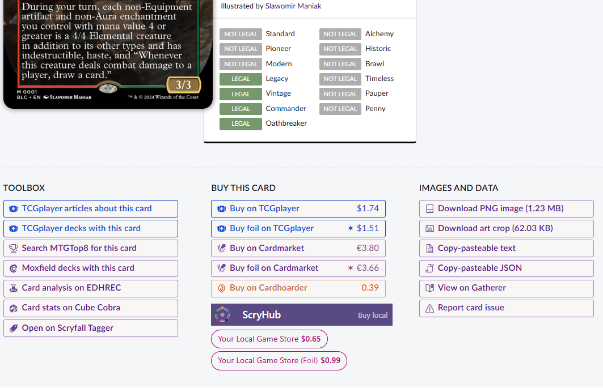

# ScryHub

 

A chrome extension that enhances Scryfall with buttons to purchase cards from your preferred Local game Store

## About

`ScryHub` doesn't include any game store searching capabilities, instead it relies on other chrome extensions to provide
search capabilities for specific stores.

`ScryHub` simply communicates with those extensions and presents their data.

## Extensions

* View the [community extensions](./extension-registry/README.md) and see if your store is already covered
* Learn more about [Extensions](./docs/EXTENSIONS.md) and [How to make your own](./docs/EXTENSION_GUIDE.md)

## TODOS

- figure out publishing protocol
- Add toggle for scryhub to be active or not
- TODO determine svg vs png