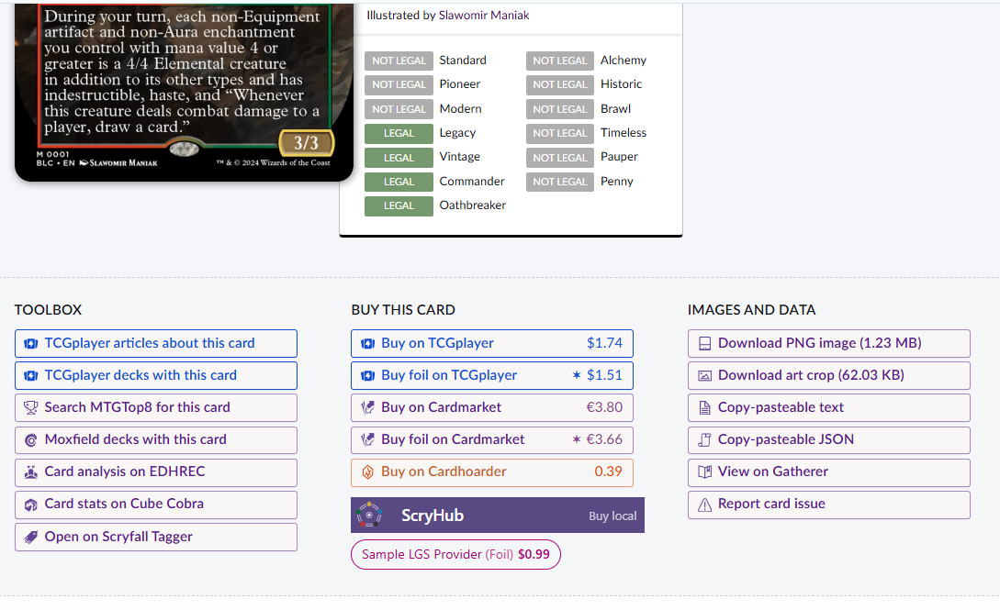

# Extension Guide

Steps for making your own extension.

Your extension (`LGSLibrary`) is a separate Chrome Extension that ScryHub talks to via core-extension messaging.

You must support the following message types:

* `scryhub.library.listStores` - return all stores you can get info for
* `scryhub.library.lookupCard` - given a store and card search, return a product result

At a high level, here's the steps we will take:

1. Define your chrome extension
1. Implement the List Stores message handling
1. Implement the Lookup card message handling
1. Hooking up our extension to `ScryHub`


## Define your Chrome Extension

You'll need a `manifest.json` file that follows Chrome's [manifest format](https://developer.chrome.com/docs/extensions/reference/manifest).

Your manifest will define:

* A [`background`](https://developer.chrome.com/docs/extensions/reference/manifest/background) service worker
  * This component handles external messages and does the work needed to compute responses
* An [`externally_connectable`](https://developer.chrome.com/docs/extensions/reference/manifest/externally-connectable) property
  * This allows the `ScryHub` extension to talk to your extension
  * You should allowlist the extension id for `ScryHub` which you can find on the main README of the extension
* A [`host_permissions`](https://developer.chrome.com/docs/extensions/develop/concepts/declare-permissions) declaration
  * This should have the hosts for the site you are providing information for, your extension will try to get data from this host
* A [`web_accessible_resources`](https://developer.chrome.com/docs/extensions/reference/manifest/web-accessible-resources) declaration
  * You should grant `Scryfall` access to your store's logo (if you want to display one on the scryfall page)
  * You should grant `ScryHub` access to your store's logo (if you want to display one in the options page)
    * You'll have to allowlist the extension id for `ScryHub` in the `extension_ids` array to allow this

Your manifest would look something like this:

```json
{
    "manifest_version": 3,
    "name": "ScryHub LGS Library Sample",
    "version": "0.1.0",
    "description": "Provides LGS lookups to ScryHub.",
    "host_permissions": [
        "https://*.examplelgs.com/*"
    ],
    "background": {
        "service_worker": "background.js"
    },
    "externally_connectable": {
        "ids": [
            "<ScryHubCoreExtensionID>"
        ]
    },
    "web_accessible_resources": [
        {
            "resources": [
                "logos/*"
            ],
            "matches": [
                "https://scryfall.com/*"
            ],
            "extension_ids": [
                "<ScryHubCoreExtensionID>"
            ]
        }
    ]
}
```

## Implement the List Stores Message

The `scryhub.library.listStores` request asks your extension for an array of `Store` references.

The request for `scryhub.library.listStores` will send an object with the following properties:

* `type`: "scryhub.library.listStores"


The response to the `scryhub.library.listStores` message can return either a success or error response. A successful response should return an array with objects with the following properties:

* `key`: a unique identifier within your library to distinguish it from other stores, within your library
* `name`: A human displayable name to identify this store, this will show up next to the text "Buy at" on the scryfall website
* `logoUrl`: _optional_ a `URL` to use when fetching the logo for this store, usually a `chrome.runtime.getURL("iconHere")` that serves a logo shipped with your extension.


If you're returning an error, respond with:

```javascript
{
    ok: false, 
    // optional error details
    error: "details why the request failed"
}
```

If you're returning a success, respond with:
```javascript
{
    ok: true,
    // array of stores you support, can be empty if they're disabled on your end
    stores: [
        {
            key: 'some-internal-key',
            name: 'a friendly name',
            // optional logo
            logoUrl: chrome.runtime.getURL("logos/sample_icon@64.png")
        }
    ]
}
```

`ScryHub` will send a request via the Chrome messaging system, so you must handle things in `chrome.runtime.onMessageExternal`.

Your initial `background.js` may look something like this:

```javascript
// Take this from the docs / protocol package in case it changes
// Take this from the docs / protocol package in case it changes
const MSG_LIST_STORES = "scryhub.library.listStores";

const sampleStore = {
    key: 'sample-lgs-provider',
    name: 'Sample LGS Provider',
    logoUrl: chrome.runtime.getURL("logos/sample_icon@64.png")
}

chrome.runtime.onMessageExternal.addListener((msg, sender, sendResponse) => {
    if(msg?.type === MSG_LIST_STORES) {
         console.log('[Sample Library]', 'Listing Stores');
         sendResponse({
            ok: true, stores: [sampleStore]
         });
    }

    // keep the channel open for an async call it is not needed for the list response
    return true;
}); 
```

Test it out via the following:

1. Load your extension as an `unpacked` extension
2. Select the `service worker` for `ScryHub` via "Inspect Views, service worker"
3. Run this in the developer console
```javascript
const libraryId = "<your extension id from the page>";
chrome.runtime.sendMessage(libraryId, { type: "scryhub.library.listStores" }, console.log);
```

You should see it print the store!

## Implement the Lookup card message handling

The `scryhub.library.lookupCard` requests asks your extension to lookup card availability and price information from a specific store. A library could provide multiple stores, so you'll get a request for the store based on the `key` you defined in the `listStores` response.

The request for `scryhub.library.lookupCard` will send an object with the following properties:

* `type`: "scryhub.library.lookupCard"
* `storeKey`: the key you identify this store as
* `descriptor`: An object that gives you information about the card:
  * `name`: name of the card as it is displayed on scryfall
  * `scryfallTitle`: _if available_ the formatted title of the card, taken from the image of the card
  * `setCode`: _if available_ the magic set code, like "FIN" or "EOE"
  * `collectorNumber`: _if available_ the number within the set code
  * `borderTreatment`: _if available_ the type of border as displayed on scryfall (black/gray/borderless)

This request handles "I looked but did not find anything" as a successful response, with an inner 'not found' style response.

Successful responses expect a `CardLookupResult` object which determines whether:

1. The card can be found at the store (it may exist but be out of stock temporarily)
2. The price of the card at the store
3. If it is out of stock or not


The response to the `scryhub.library.lookupCard` message can return either a success or error response.

If you're returning an error, respond with:

```javascript
{
    ok: false, 
    // optional error details
    error: "details why the request failed"
}
```

If you're returning a success, respond with a `CardLookupResult` and the following properties:
```javascript
{
    ok: true,
    // the identifier for your store
    storeKey: 'some-internal-key';
    // data for the lookup operation, not finding a card can still be considered successful
    result: CardLookupResult;
}
```

The `CardLookupResult` object indicates whether the card was found at the store or not, and if it was found, what information the store has.

It can either be:

* `found`: `false`
  * for times when the card isn't even listed on the store

* `found`: `true`
  * when the card is listed on the store, regardless of availability
* `card`: More details about the card
  * `url`: A direct URL that would take a user to purchase this card
  * `title`: The title of the card on the store (if its formatted differently)
  * `price`: _if available_ An object that defines the price of the card
    * `amount`: numeric amount in decimal format `3.99`
    * `currency`: the currency code for the amount
  * `availability`: whether the card is in stock or not, if the store does not have enough info to detemrine this, return `unknown`

Possible responses you may have can be:

```javascript
{
    ok: true,
    storeKey: 'some-internal-key';
    // did not find it in the store
    result: {
        found: false
    };
}
```

```javascript
{
    ok: true,
    storeKey: 'some-internal-key';
    // did not find it in the store
    result: {
        found: true,
        card: {
            url: 'http://buyithere/thecard.html',
            title: 'the card you looked for',
            price: { amount: 3.99, currency: 'eur' },
            availability: 'in_stock'
        }
    };
}
```

Your updated `background.js` may look something like this:

1. Make an `async` function that will lookup the card from your store
  1. Here is where you would call an API or get data from the store in some fashion
```javascript
async function lookupCardFromSite(cardSearch) {
    const name = cardSearch.scryfallTitle || cardSearch.name;
    return {
        found: true,
        card: {
            title: name,
            url: 'https://github.com/AnEmortalKid/scryhub',
            price: {
                amount: 0.99,
                currency: 'USD'
            },
            availability: "in_stock"
        }
    }
}
```
2. Update the listener to call this function based on message type
```javascript
    if(msg?.type === MSG_LOOKUP_CARD) {
        console.log('[Sample Library]', 'Looking up card');
        lookupCardFromSite(msg.descriptor).then((cardInfo) => {
            sendResponse(
                {ok: true, storeKey: sampleStore.key, result:cardInfo }
            );
        });
    }
```

The full version can be found here:
```javascript
// Take this from the docs / protocol package in case it changes
const MSG_LIST_STORES = "scryhub.library.listStores";
const MSG_LOOKUP_CARD = "scryhub.library.lookupCard";

const sampleStore = {
    key: 'sample-lgs-provider',
    name: 'Sample LGS Provider',
    logoUrl: chrome.runtime.getURL("logos/sample_icon@64.png")
}

async function lookupCardFromSite(cardSearch) {
    return {
        found: true,
        card: {
            title: cardSearch.name,
            url: 'https://github.com/AnEmortalKid/scryhub',
            price: {
                amount: 0.99,
                currency: 'usd'
            },
            availability: "in_stock"
        }
    }
}

chrome.runtime.onMessageExternal.addListener((msg, sender, sendResponse) => {
    if(msg?.type === MSG_LIST_STORES) {
         console.log('[Sample Library]', 'Listing Stores');
         sendResponse({
            ok: true, stores: [sampleStore]
         });
    }

    if(msg?.type === MSG_LOOKUP_CARD) {
        console.log('[Sample Library]', 'Looking up card');
        lookupCardFromSite(msg.descriptor).then((cardInfo) => {
            sendResponse(
                {ok: true, storeKey: sampleStore.key, result:cardInfo }
            );
        });
    }

    // keep the channel open for the async call
    return true;
}); 
```

Test it out via the following:

1. Load your extension as an `unpacked` extension
2. Select the `service worker` for `ScryHub` via "Inspect Views, service worker"
3. Run this in the developer console
```javascript
const libraryId = "<your extension id from the page>";
chrome.runtime.sendMessage(libraryId, 
{ 
    type: "scryhub.library.lookupCard", 
    storeKey: "sample-lgs-provider", 
    descriptor: { 
        name: "Bello, Bard of the Brambles",
        setCode: "BLC",
        collectorNumber: "1",
        scryfallTitle: "Bello, Bard of the Brambles (Bloomburrow Commander #1)",
        borderTreatment: "border-borderless"
    }
}, 
console.log);
```

You should see it print the card info!


## Hooking up our extension to

Once your extension is working, it is time to connect it to `ScryHub`.

1. From `chrome://extensions/` , find `ScryHub`
2. From the `Details` section, find the `Extension Options` tab
3. On the options page, you should be albe to add your extension via ID

4. You should see the sample store available 

5. Navigate to any ScryFall card page, [like this one](https://scryfall.com/card/blc/1/bello-bard-of-the-brambles). You should see a button for the sample extension with the information we returned
